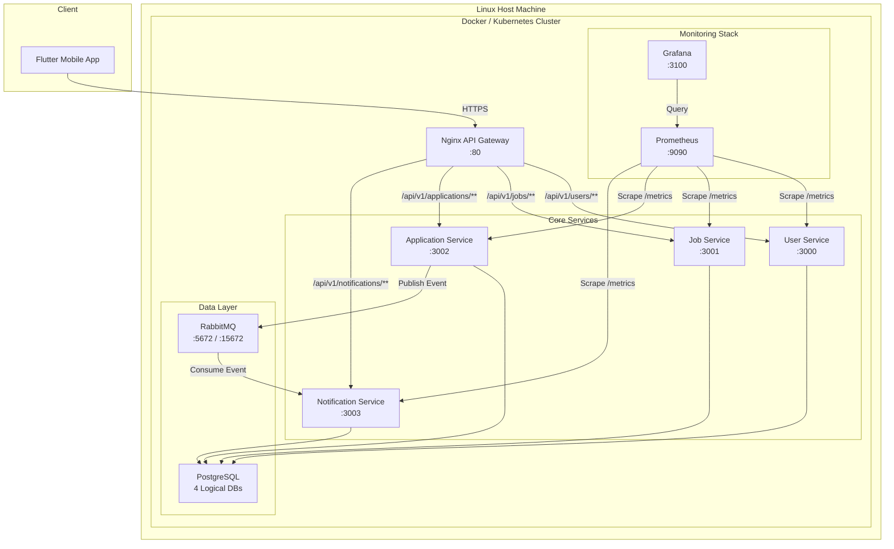

# System Design & API Specification

## Job Portal Microservices Platform

---

## Table of Contents

1. [System Architecture & Component Mapping](https://www.notion.so/Cloud-Project-Documenation-353a465a2736800781b0fda2bb0feab0?pvs=21)
2. [Networking Schema](https://www.notion.so/Cloud-Project-Documenation-353a465a2736800781b0fda2bb0feab0?pvs=21)
3. [API Contract](https://www.notion.so/Cloud-Project-Documenation-353a465a2736800781b0fda2bb0feab0?pvs=21)
4. [Infrastructure & DevOps Blueprint](https://www.notion.so/Cloud-Project-Documenation-353a465a2736800781b0fda2bb0feab0?pvs=21)
5. [Rubric Compliance Matrix](https://www.notion.so/Cloud-Project-Documenation-353a465a2736800781b0fda2bb0feab0?pvs=21)

---

## 1. System Architecture & Component Mapping

### 1.1 Microservices Breakdown

| # | Service | Responsibility | Tech Stack |
| --- | --- | --- | --- |
| 1 | **User Service** | Registration, Login (JWT), Profile CRUD | Node.js + Express |
| 2 | **Job Service** | Job Posting CRUD, Search/Filter | Node.js + Express |
| 3 | **Application Service** | Submit Application, Status Tracking, publishes events to RabbitMQ | Node.js + Express |
| 4 | **Notification Service** | Consumes RabbitMQ events, stores & serves notifications | Node.js + Express |
| — | **API Gateway** | Reverse proxy, route mapping, CORS | Nginx |

### 1.2 Data Ownership (Database-per-Service)

Each service owns its data via a **logically isolated database** inside a single PostgreSQL container.

| Service | Database Name | Key Tables |
| --- | --- | --- |
| User Service | `user_db` | `users` |
| Job Service | `job_db` | `jobs` |
| Application Service | `application_db` | `applications` |
| Notification Service | `notification_db` | `notifications` |

**PostgreSQL Init Script** (`infra/init-databases.sql`):

```sql
-- Executed by the postgres container on first boot
CREATE DATABASE user_db;
CREATE DATABASE job_db;
CREATE DATABASE application_db;
CREATE DATABASE notification_db;
```

### 1.3 Communication Flow

### Synchronous Path (HTTP/REST)

```
Flutter App ──HTTPS──> Nginx Gateway ──HTTP──> target-service:PORT/api/v1/...
```

### Asynchronous Path (RabbitMQ)

```
Application Service ──publish──> RabbitMQ [application_events] ──consume──> Notification Service
```

**Events Published:**

| Event Name | Payload | Trigger |
| --- | --- | --- |
| `application.submitted` | `{ applicationId, jobId, seekerId, employerId }` | Seeker submits application |
| `application.status_changed` | `{ applicationId, seekerId, newStatus }` | Employer updates status |

### 1.4 System Architecture Diagram



---

## 2. Networking Schema

### 2.1 Simultaneous Environment Strategy

**Approach:** Three separate `docker-compose.<env>.yml` files, each defining its own **isolated Docker network** and a **unique host-port range**.

| File | Network Name | Port Range | Purpose |
| --- | --- | --- | --- |
| `docker-compose.dev.yml` | `jobportal-dev` | `3100–3199` | Hot-reload, debug logs |
| `docker-compose.test.yml` | `jobportal-test` | `3200–3299` | Integration/E2E tests |
| `docker-compose.prod.yml` | `jobportal-prod` | `3300–3399` | Optimized production build |

**Launch commands (can run simultaneously):**

```bash
# Terminal 1 — Dev
docker-compose -f docker-compose.dev.yml -p jobportal-dev up -d

# Terminal 2 — Test
docker-compose -f docker-compose.test.yml -p jobportal-test up -d

# Terminal 3 — Prod
docker-compose -f docker-compose.prod.yml -p jobportal-prod up -d
```

### 2.2 Port Map Table

| Service | Internal Port | Dev (Host) | Test (Host) | Prod (Host) |
| --- | --- | --- | --- | --- |
| **Nginx Gateway** | 80 | 3100 | 3200 | 3300 |
| **User Service** | 3000 | 3101 | 3201 | 3301 |
| **Job Service** | 3001 | 3102 | 3202 | 3302 |
| **Application Service** | 3002 | 3103 | 3203 | 3303 |
| **Notification Service** | 3003 | 3104 | 3204 | 3304 |
| **PostgreSQL** | 5432 | 3110 | 3210 | 3310 |
| **RabbitMQ (AMQP)** | 5672 | 3111 | 3211 | 3311 |
| **RabbitMQ (Mgmt UI)** | 15672 | 3112 | 3212 | 3312 |
| **Prometheus** | 9090 | 3120 | 3220 | 3320 |
| **Grafana** | 3000 | 3121 | 3221 | 3321 |

### 2.3 DNS / Service Discovery Strategy

Within each Docker Compose project, services discover each other by **container name**. Environment is embedded in the container/service name:

| Service | Dev Container Name | Test Container Name | Prod Container Name |
| --- | --- | --- | --- |
| User Service | `user-service-dev` | `user-service-test` | `user-service-prod` |
| Job Service | `job-service-dev` | `job-service-test` | `job-service-prod` |
| Application Service | `app-service-dev` | `app-service-test` | `app-service-prod` |
| Notification Service | `notif-service-dev` | `notif-service-test` | `notif-service-prod` |
| PostgreSQL | `postgres-dev` | `postgres-test` | `postgres-prod` |
| RabbitMQ | `rabbitmq-dev` | `rabbitmq-test` | `rabbitmq-prod` |

**Nginx upstream example** (`nginx/nginx.conf`):

```
upstream user_service {
    server user-service-dev:3000;  # name changes per env
}
```

**Kubernetes:** In K8s, each service gets a `ClusterIP` Service object. Discovery uses: `<service-name>.<namespace>.svc.cluster.local`

Example: `user-service.jobportal-prod.svc.cluster.local:3000`

---

## 3. API Contract

### 3.1 Global Conventions

| Convention | Value |
| --- | --- |
| Base Path | `/api/v1` |
| Content-Type | `application/json` |
| Auth Header | `Authorization: Bearer <JWT>` |
| Success Envelope | `{ "success": true, "data": { ... } }` |
| Error Envelope | `{ "success": false, "error": { "code": "ERROR_CODE", "message": "..." } }` |
| Pagination | `?page=1&limit=20` → Response includes `meta: { page, limit, total }` |

### 3.2 JWT Implementation

**Token Generation:** User Service issues JWT on login/register.

**Algorithm:** `HS256`

**Expiry:** `24h`

**JWT Payload (Claims):**

```json
{
  "userId": "uuid-string",
  "email": "user@example.com",
  "role": "seeker | employer",
  "iat": 1714520000,
  "exp": 1714606400
}
```

**Cross-Service Auth:** Every service validates the JWT independently using a **shared secret** (`JWT_SECRET` injected via environment variable / K8s Secret). No service-to-service auth tokens needed — only the gateway forwards the client's token.

### 3.3 Auth Endpoints — User Service

### `POST /api/v1/users/register`

**Access:** Public

**Request:**

```json
{
  "name": "Ahmad Ali",
  "email": "ahmad@example.com",
  "password": "SecureP@ss1",
  "role": "seeker"
}
```

> `role` must be `"seeker"` or `"employer"`.
> 

**Response `201 Created`:**

```json
{
  "success": true,
  "data": {
    "user": {
      "id": "a1b2c3d4-uuid",
      "name": "Ahmad Ali",
      "email": "ahmad@example.com",
      "role": "seeker",
      "createdAt": "2026-05-01T00:00:00Z"
    },
    "token": "eyJhbGciOiJIUzI1NiIs..."
  }
}
```

**Error `409 Conflict`:**

```json
{
  "success": false,
  "error": { "code": "EMAIL_EXISTS", "message": "Email already registered." }
}
```

---

### `POST /api/v1/users/login`

**Access:** Public

**Request:**

```json
{
  "email": "ahmad@example.com",
  "password": "SecureP@ss1"
}
```

**Response `200 OK`:**

```json
{
  "success": true,
  "data": {
    "user": {
      "id": "a1b2c3d4-uuid",
      "name": "Ahmad Ali",
      "email": "ahmad@example.com",
      "role": "seeker"
    },
    "token": "eyJhbGciOiJIUzI1NiIs..."
  }
}
```

**Error `401 Unauthorized`:**

```json
{
  "success": false,
  "error": { "code": "INVALID_CREDENTIALS", "message": "Email or password is incorrect." }
}
```

---

### `GET /api/v1/users/profile`

**Access:** Authenticated (any role)

**Headers:** `Authorization: Bearer <token>`

**Response `200 OK`:**

```json
{
  "success": true,
  "data": {
    "id": "a1b2c3d4-uuid",
    "name": "Ahmad Ali",
    "email": "ahmad@example.com",
    "role": "seeker",
    "createdAt": "2026-05-01T00:00:00Z"
  }
}
```

---

### 3.4 Job Endpoints — Job Service

### `POST /api/v1/jobs`

**Access:** Authenticated — `employer` only

**Request:**

```json
{
  "title": "Backend Developer",
  "company": "TechCorp",
  "location": "Amman, Jordan",
  "description": "Build scalable APIs.",
  "salary": "1500 JOD"
}
```

**Response `201 Created`:**

```json
{
  "success": true,
  "data": {
    "id": "job-uuid-001",
    "title": "Backend Developer",
    "company": "TechCorp",
    "location": "Amman, Jordan",
    "description": "Build scalable APIs.",
    "salary": "1500 JOD",
    "employerId": "emp-uuid-001",
    "createdAt": "2026-05-01T00:00:00Z"
  }
}
```

---

### `GET /api/v1/jobs`

**Access:** Public (or Authenticated)

**Query Params:** `?search=backend&location=Amman&page=1&limit=20`

**Response `200 OK`:**

```json
{
  "success": true,
  "data": [
    {
      "id": "job-uuid-001",
      "title": "Backend Developer",
      "company": "TechCorp",
      "location": "Amman, Jordan",
      "salary": "1500 JOD",
      "employerId": "emp-uuid-001",
      "createdAt": "2026-05-01T00:00:00Z"
    }
  ],
  "meta": { "page": 1, "limit": 20, "total": 1 }
}
```

---

### `GET /api/v1/jobs/:id`

**Access:** Public

**Response `200 OK`:**

```json
{
  "success": true,
  "data": {
    "id": "job-uuid-001",
    "title": "Backend Developer",
    "company": "TechCorp",
    "location": "Amman, Jordan",
    "description": "Build scalable APIs.",
    "salary": "1500 JOD",
    "employerId": "emp-uuid-001",
    "createdAt": "2026-05-01T00:00:00Z"
  }
}
```

---

### 3.5 Application Endpoints — Application Service

### `POST /api/v1/applications`

**Access:** Authenticated — `seeker` only

**Request:**

```json
{
  "jobId": "job-uuid-001",
  "coverLetter": "I am a great fit for this role..."
}
```

**Response `201 Created`:**

```json
{
  "success": true,
  "data": {
    "id": "app-uuid-001",
    "jobId": "job-uuid-001",
    "seekerId": "a1b2c3d4-uuid",
    "coverLetter": "I am a great fit for this role...",
    "status": "pending",
    "createdAt": "2026-05-01T00:00:00Z"
  }
}
```

> **Side Effect:** Publishes `application.submitted` event to RabbitMQ.
> 

---

### `PATCH /api/v1/applications/:id/status`

**Access:** Authenticated — `employer` only

**Request:**

```json
{
  "status": "accepted"
}
```

> Valid statuses: `"pending"` | `"reviewed"` | `"accepted"` | `"rejected"`
> 

**Response `200 OK`:**

```json
{
  "success": true,
  "data": {
    "id": "app-uuid-001",
    "jobId": "job-uuid-001",
    "seekerId": "a1b2c3d4-uuid",
    "status": "accepted",
    "updatedAt": "2026-05-01T12:00:00Z"
  }
}
```

> **Side Effect:** Publishes `application.status_changed` event to RabbitMQ.
> 

---

### `GET /api/v1/applications?role=seeker`

**Access:** Authenticated

- **Seeker** sees their own applications.
- **Employer** sees applications for their posted jobs.

**Response `200 OK`:**

```json
{
  "success": true,
  "data": [
    {
      "id": "app-uuid-001",
      "jobId": "job-uuid-001",
      "seekerId": "a1b2c3d4-uuid",
      "status": "pending",
      "createdAt": "2026-05-01T00:00:00Z"
    }
  ],
  "meta": { "page": 1, "limit": 20, "total": 1 }
}
```

---

### 3.6 Notification Endpoints — Notification Service

### `GET /api/v1/notifications`

**Access:** Authenticated (returns notifications for the logged-in user)

**Response `200 OK`:**

```json
{
  "success": true,
  "data": [
    {
      "id": "notif-uuid-001",
      "userId": "a1b2c3d4-uuid",
      "message": "Your application for 'Backend Developer' has been accepted!",
      "read": false,
      "createdAt": "2026-05-01T12:00:00Z"
    }
  ]
}
```

---

## 4. Infrastructure & DevOps Blueprint

### 4.1 Monorepo Folder Structure

```
job-portal-microservices-k8s/
├── services/
│   ├── user-service/
│   │   ├── src/
│   │   ├── Dockerfile              # Production multi-stage
│   │   ├── Dockerfile.dev          # Dev with nodemon
│   │   ├── package.json
│   │   └── .env.example
│   ├── job-service/
│   │   ├── src/
│   │   ├── Dockerfile
│   │   ├── Dockerfile.dev
│   │   └── package.json
│   ├── application-service/
│   │   ├── src/
│   │   ├── Dockerfile
│   │   ├── Dockerfile.dev
│   │   └── package.json
│   └── notification-service/
│       ├── src/
│       ├── Dockerfile
│       ├── Dockerfile.dev
│       └── package.json
├── gateway/
│   ├── nginx.dev.conf
│   ├── nginx.test.conf
│   ├── nginx.prod.conf
│   └── Dockerfile
├── infra/
│   ├── init-databases.sql
│   ├── prometheus/
│   │   └── prometheus.yml
│   └── grafana/
│       └── dashboards/
├── k8s/
│   ├── namespace.yml
│   ├── secrets.yml
│   ├── configmap.yml
│   ├── user-service/
│   │   ├── deployment.yml
│   │   └── service.yml
│   ├── job-service/
│   │   ├── deployment.yml
│   │   └── service.yml
│   ├── application-service/
│   │   ├── deployment.yml
│   │   └── service.yml
│   ├── notification-service/
│   │   ├── deployment.yml
│   │   └── service.yml
│   ├── postgres/
│   │   ├── deployment.yml
│   │   ├── service.yml
│   │   └── pvc.yml
│   ├── rabbitmq/
│   │   ├── deployment.yml
│   │   └── service.yml
│   ├── nginx/
│   │   ├── deployment.yml
│   │   └── service.yml
│   └── monitoring/
│       ├── prometheus-deployment.yml
│       └── grafana-deployment.yml
├── docker-compose.dev.yml
├── docker-compose.test.yml
├── docker-compose.prod.yml
└── README.md
```

### 4.2 Docker Strategy

**Different Images (5 custom + 3 off-the-shelf = 8 total):**

| # | Image | Type |
| --- | --- | --- |
| 1 | `jobportal/user-service` | Custom |
| 2 | `jobportal/job-service` | Custom |
| 3 | `jobportal/app-service` | Custom |
| 4 | `jobportal/notif-service` | Custom |
| 5 | `jobportal/gateway` | Custom (Nginx + config) |
| 6 | `postgres:16-alpine` | Official |
| 7 | `rabbitmq:3-management-alpine` | Official |
| 8 | `prom/prometheus` + `grafana/grafana` | Official |

### Production `Dockerfile` (Multi-Stage)

```docker
# ---- Stage 1: Build ----
FROM node:20-alpine AS builder
WORKDIR /app
COPY package*.json ./
RUN npm ci --only=production
COPY src/ ./src/

# ---- Stage 2: Runtime ----
FROM node:20-alpine AS runtime
WORKDIR /app
RUN addgroup -S appgroup && adduser -S appuser -G appgroup
COPY --from=builder /app/node_modules ./node_modules
COPY --from=builder /app/src ./src
COPY package.json ./
USER appuser
EXPOSE 3000
CMD ["node", "src/index.js"]
```

### Development `Dockerfile.dev`

```docker
FROM node:20-alpine
WORKDIR /app
COPY package*.json ./
RUN npm install
# Source is bind-mounted, not COPY'd
EXPOSE 3000
CMD ["npx", "nodemon", "src/index.js"]
```

**Key Difference:** Dev uses `nodemon` + bind mounts for hot-reload. Prod uses multi-stage for minimal image size (~120MB vs ~300MB).

### 4.3 Docker Compose Environment Differentiation

**`docker-compose.dev.yml` extras:**

- Bind mounts: `./services/user-service/src:/app/src`
- `NODE_ENV=development`
- Debug ports exposed
- `restart: "no"`

**`docker-compose.prod.yml` extras:**

- No bind mounts (baked-in code)
- `NODE_ENV=production`
- `restart: always`
- Resource limits set

### 4.4 Kubernetes Strategy

### Namespace Isolation

```yaml
apiVersion: v1
kind: Namespace
metadata:
  name: jobportal-prod
```

### Deployment Strategy — RollingUpdate

```yaml
apiVersion: apps/v1
kind: Deployment
metadata:
  name: user-service
  namespace: jobportal-prod
spec:
  replicas: 2
  strategy:
    type: RollingUpdate
    rollingUpdate:
      maxUnavailable: 0
      maxSurge: 1
  selector:
    matchLabels:
      app: user-service
  template:
    metadata:
      labels:
        app: user-service
    spec:
      containers:
        - name: user-service
          image: jobportal/user-service:1.0.0
          ports:
            - containerPort: 3000
          envFrom:
            - configMapRef:
                name: jobportal-config
            - secretRef:
                name: jobportal-secrets
          readinessProbe:
            httpGet:
              path: /health
              port: 3000
            initialDelaySeconds: 5
            periodSeconds: 10
          livenessProbe:
            httpGet:
              path: /health
              port: 3000
            initialDelaySeconds: 15
            periodSeconds: 20
          resources:
            requests:
              memory: "128Mi"
              cpu: "100m"
            limits:
              memory: "256Mi"
              cpu: "250m"
```

### ConfigMap (Non-Sensitive)

```yaml
apiVersion: v1
kind: ConfigMap
metadata:
  name: jobportal-config
  namespace: jobportal-prod
data:
  NODE_ENV: "production"
  DB_HOST: "postgres-service"
  DB_PORT: "5432"
  RABBITMQ_URL: "amqp://rabbitmq-service:5672"
  USER_SERVICE_DB: "user_db"
  JOB_SERVICE_DB: "job_db"
  APP_SERVICE_DB: "application_db"
  NOTIF_SERVICE_DB: "notification_db"
```

### Secrets (Sensitive)

```yaml
apiVersion: v1
kind: Secret
metadata:
  name: jobportal-secrets
  namespace: jobportal-prod
type: Opaque
data:
  JWT_SECRET: <base64-encoded>
  DB_USER: <base64-encoded>
  DB_PASSWORD: <base64-encoded>
  RABBITMQ_USER: <base64-encoded>
  RABBITMQ_PASS: <base64-encoded>
```

### Service (ClusterIP)

```yaml
apiVersion: v1
kind: Service
metadata:
  name: user-service
  namespace: jobportal-prod
spec:
  type: ClusterIP
  selector:
    app: user-service
  ports:
    - port: 3000
      targetPort: 3000
```

### 4.5 Monitoring Strategy

### Prometheus Scrape Configuration (`infra/prometheus/prometheus.yml`)

```yaml
global:
  scrape_interval: 15s

scrape_configs:
  - job_name: "user-service"
    static_configs:
      - targets: ["user-service:3000"]
    metrics_path: "/metrics"

  - job_name: "job-service"
    static_configs:
      - targets: ["job-service:3001"]
    metrics_path: "/metrics"

  - job_name: "application-service"
    static_configs:
      - targets: ["application-service:3002"]
    metrics_path: "/metrics"

  - job_name: "notification-service"
    static_configs:
      - targets: ["notification-service:3003"]
    metrics_path: "/metrics"
```

### Application-Level Metrics

Each service exposes a `/metrics` endpoint using `prom-client` (Node.js):

```jsx
// src/metrics.js — shared across all services
const client = require('prom-client');
const register = new client.Registry();

client.collectDefaultMetrics({ register });

const httpRequestDuration = new client.Histogram({
  name: 'http_request_duration_seconds',
  help: 'Duration of HTTP requests in seconds',
  labelNames: ['method', 'route', 'status_code'],
  buckets: [0.01, 0.05, 0.1, 0.5, 1, 5],
});
register.registerMetric(httpRequestDuration);

module.exports = { register, httpRequestDuration };
```

### Grafana Dashboards

| Dashboard | Panels |
| --- | --- |
| **Service Health** | Request rate, Error rate (4xx/5xx), P95 latency per service |
| **Infrastructure** | CPU/Memory per container, PostgreSQL connections, RabbitMQ queue depth |

---